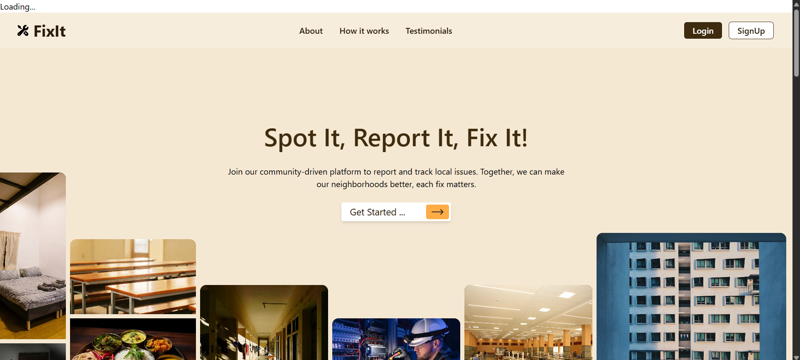
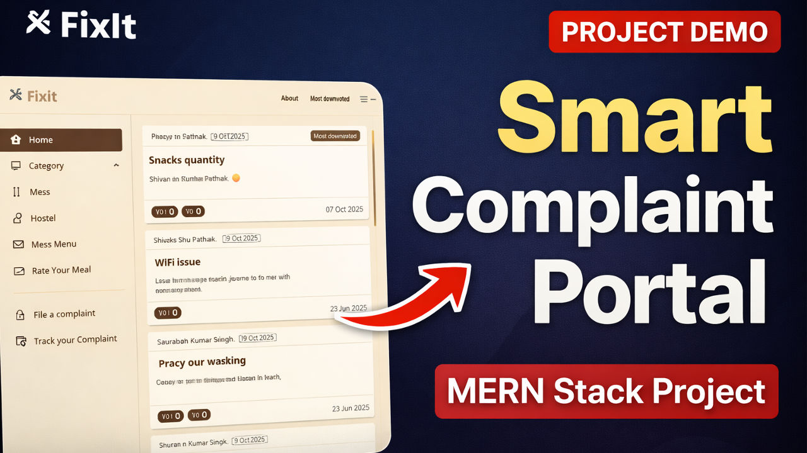

<a id="readme-top"></a>

<div align="center">

[](https://github.com/Shivanshu0915/fixit/graphs/contributors)&nbsp;[](https://github.com/Shivanshu0915/fixit/network/members)&nbsp;[](https://github.com/Shivanshu0915/fixit/stargazers)&nbsp;[](https://github.com/Shivanshu0915/fixit/issues)&nbsp;[](https://github.com/Shivanshu0915/fixit/blob/main/LICENSE.txt)&nbsp;[](https://www.linkedin.com/in/shivanshu-pathak-11449b283/)

</div>
<br />
<div align="center">
  <a href="https://github.com/Shivanshu0915/fixit">
    
  </a>

<h3 align="center">FixIt © 2025</h3>
  <p align="center">
    A seamless hostel and mess complaint management platform for colleges and universities.
    <br />
    <br />
     <a href="https://fixit-fpvg.onrender.com/">
      
    </a>
    <a href="https://youtu.be/PPlCbUlSRHE">
      
    </a>
    <br />
    <br />
    <strong>Demo Credentials</strong><br/>
    User → shivanshu.20233267@mnnit.ac.in | shivanshu <br/>
    Admin → shivanshu.20233267@mnnit.ac.in | shivanshu
    <br />
    <br />
    <a href="https://github.com/Shivanshu0915/fixit/issues">Report Bug</a>
    * 
    <a href="https://github.com/Shivanshu0915/fixit/issues">Request Feature</a>
  </p>
</div>

<details class="toc">
  <summary>Table of Contents</summary>
  <ol>
    <li>
      <a href="#about-the-project">About The Project</a>
      <ul>
        <li><a href="#built-with">Built With</a></li>
      </ul>
    </li>
    <li><a href="#-screenshots--demo">Screenshots & Demo</a></li>
    <li>
      <a href="#getting-started">Getting Started</a>
      <ul>
        <li><a href="#prerequisites">Prerequisites</a></li>
        <li><a href="#installation">Installation</a></li>
      </ul>
    </li>
    <li><a href="#usage">Usage</a></li>
    <li><a href="#roadmap">Roadmap</a></li>
    <li><a href="#contributing">Contributing</a></li>
    <li><a href="#license">License</a></li>
    <li><a href="#contact">Contact</a></li>
  </ol>
</details>


## About The Project

**FixIt** is a comprehensive platform designed to streamline the process of managing hostel and mess complaints within college campuses. It provides a dedicated digital space for students to raise issues and for administrators to efficiently track, manage, and resolve them.

**Key Features:**
* **Student-Centric Complaint System:** Students can easily file complaints with detailed descriptions and media uploads (images/videos) and track the status of their submissions.
* **Secure & Role-Based Access:** Features robust, JWT-based authentication with secure login/signup flows using access and refresh tokens. Access is tailored for different roles (e.g., student, admin).
* **Dynamic Complaint Feed:** An infinite scrolling feed for complaints, complete with powerful filters for category, date, and votes, powered by cursor-based pagination.
* **Mess & Menu Management:** Students can view the daily mess menu specific to their hostel and rate their meals.
* **Admin Dashboard:** A powerful dashboard for administrators to view and manage unresolved complaints, neatly categorized by hostel and type (mess/general).

<p align="right">(<a href="#readme-top">back to top</a>)</p>

### Built With

This project is built with a modern, scalable, and robust tech stack.

* [![React][React.js]][React-url]
* [![Node][Node.js]][Node-url]
* [![Express][Express.js]][Express-url]
* [![MongoDB][MongoDB]][Mongo-url]
* [![TailwindCSS][TailwindCSS]][TailwindCSS-url]
* **Authentication:** JSON Web Tokens (JWT)
* **Schema Validation:** Zod
* **Media Storage:** Cloudinary

<p align="right">(<a href="#readme-top">back to top</a>)</p>


## 📸 Screenshots & Demo

### Screenshots

<br/>


<br/>
<br/>

### Video Demo

Watch the full live walkthrough of FixIt — features, workflows, and dashboards.

[](https://youtu.be/PPlCbUlSRHE)

<p align="right">(<a href="#readme-top">back to top</a>)</p>


## Getting Started

To get a local copy up and running, follow these simple steps.

### Prerequisites

Ensure you have the following installed on your local development machine:
* Node.js (v18.x or later)
* npm
    ```sh
    npm install npm@latest -g
    ```
* A MongoDB database (local or a cloud instance from MongoDB Atlas)

### Installation

1.  **Clone the repository**
    ```sh
    git clone https://github.com/Shivanshu0915/fixit.git
    ```
2.  **Backend Setup**
    * Navigate to the backend directory:
        ```sh
        cd fixit/backend
        ```
    * Install NPM packages (this will install all dependencies from `package.json`):
        ```sh
        npm install
        ```
    * Create a `.env` file in the `backend` directory and add the following variables:
        ```env
        # Server Configuration
        NODE_ENV=development
        PORT=3000
        
        # Database
        MONGODB_URI=your_mongodb_connection_string
        
        # JWT Secrets
        ACCESS_JWT_TOKEN_SECRET=your_super_secret_access_token
        REFRESH_JWT_TOKEN_SECRET=your_super_secret_refresh_token
        
        # Cookie Settings
        COOKIE_SECURE=false
        COOKIE_SAMESITE=lax
        
        # URLs
        FRONTEND_URL=http://localhost:5173
        BACKEND_URL=http://localhost:3000
        
        # Email Service (e.g., Gmail)
        EMAIL_SERVICE=gmail
        EMAIL_PORT=587
        EMAIL_USER=your_email@gmail.com
        EMAIL_PASS=your_gmail_app_password
        EMAIL_BOSS=admin_email_to_receive_notifications@example.com
        
        # Cloudinary API Credentials
        CLOUDINARY_CLOUD_NAME=your_cloudinary_cloud_name
        CLOUDINARY_API_KEY=your_cloudinary_api_key
        CLOUDINARY_API_SECRET=your_cloudinary_api_secret
        ```
3.  **Frontend Setup**
    * Navigate to the frontend directory:
        ```sh
        cd ../frontend
        ```
    * Install NPM packages:
        ```sh
        npm install
        ```
    * Create a `.env` file in the `frontend` directory and add the backend URL:
        ```env
        VITE_API_URL=http://localhost:3000
        ```
4.  **Run the application**
    * Start the backend server (from the `/backend` directory):
        ```sh
        nodemon server.js
        ```
    * Start the frontend server (from the `/frontend` directory):
        ```sh
        npm run dev
        ```

<p align="right">(<a href="#readme-top">back to top</a>)</p>


## Usage

Once running, the application allows users to:
1.  **Sign Up/Log In:** Users can create a student account or log in with existing credentials. Admin roles are typically pre-assigned.
2.  **File a Complaint:** Navigate to the complaints section, describe the issue, attach media if necessary, and submit.
3.  **Browse & Filter:** Use the main dashboard to scroll through existing complaints and filter them based on status, category, or date.
4.  **Rate Meals:** Check the daily mess menu and provide a rating for the meals served.

<p align="right">(<a href="#readme-top">back to top</a>)</p>


## Contributing

Contributions are what make the open-source community an amazing place to learn, inspire, and create. Any contributions you make are **greatly appreciated**.

If you have a suggestion to improve this project, please fork the repo and create a pull request. You can also simply open an issue with the tag "enhancement".
Don't forget to give the project a star! ⭐ Thanks!

1.  Fork the Project
2.  Create your Feature Branch (`git checkout -b feature/AmazingFeature`)
3.  Commit your Changes (`git commit -m 'Add some AmazingFeature'`)
4.  Push to the Branch (`git push origin feature/AmazingFeature`)
5.  Open a Pull Request

<p align="right">(<a href="#readme-top">back to top</a>)</p>


## License

This project is licensed under the **Creative Commons Attribution-NonCommercial-NoDerivatives 4.0 International License**. See the `LICENSE` file for more information.

<a href="https://creativecommons.org/licenses/by-nc-nd/4.0/">
  
</a>

This means you are free to:
- **Share** — copy and redistribute the material in any medium or format for non-commercial purposes.

Under the following terms:
- **Attribution** — You must give appropriate credit.
- **NonCommercial** — You may not use the material for commercial purposes.
- **NoDerivatives** — If you remix, transform, or build upon the material, you may not distribute the modified material.

<p align="right">(<a href="#readme-top">back to top</a>)</p>


## Contact

Saurabh Kumar Singh - [saurabh735565@gmail.com](mailto:saurabh735565@gmail.com)  
Shivanshu Pathak- [elysm1961@gmail.com](mailto:elysm1961@gmail.com)

Project Link: [https://github.com/Shivanshu0915/fixit](https://github.com/Shivanshu0915/fixit)

<p align="right">(<a href="#readme-top">back to top</a>)</p>

[React.js]: https://img.shields.io/badge/React-20232A?style=for-the-badge&logo=react&logoColor=61DAFB
[React-url]: https://reactjs.org/
[Node.js]: https://img.shields.io/badge/Node.js-339933?style=for-the-badge&logo=nodedotjs&logoColor=white
[Node-url]: https://nodejs.org/
[Express.js]: https://img.shields.io/badge/Express.js-000000?style=for-the-badge&logo=express&logoColor=white
[Express-url]: https://expressjs.com/
[MongoDB]: https://img.shields.io/badge/MongoDB-47A248?style=for-the-badge&logo=mongodb&logoColor=white
[Mongo-url]: https://www.mongodb.com/
[TailwindCSS]: https://img.shields.io/badge/Tailwind_CSS-06B6D4?style=for-the-badge&logo=tailwindcss&logoColor=white
[TailwindCSS-url]: https://tailwindcss.com/
